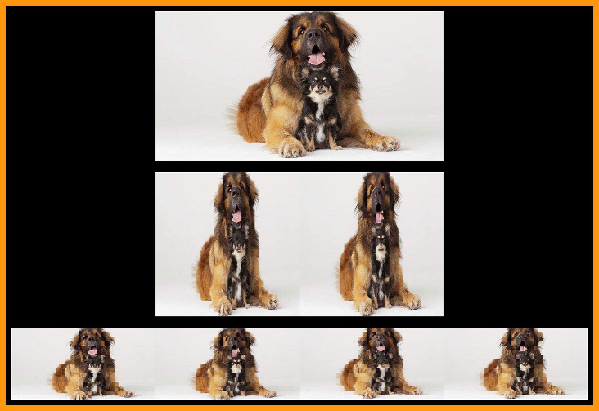

# Image Shredder

A small image processing script that slices an image vertically and horizontally, and displays the original and processed versions stacked vertically for visual comparison.

## Features

- Loads an image from file
- Crops it to prepare for clean slicing
- Slices the image vertically and horizontally
- Adds padding around images
- Combines all processed images for visualization

## Configuration

All key parameters are configured in the `config.py` file:

```python
# config.py

SLICE_WIDTH = 16
H_SLICE_COUNT = 2
V_SLICE_COUNT = 2
SPACE_AROUND_IMAGE = 20

SOURCE_PATH = 'example.png'
DESTINATION_PATH = 'result.png'
```

## Requirements

- Python 3.8+
- NumPy
- Pillow 11.2+

Install dependencies:

```bash
pip install -r requirements.txt
```

## Usage

Make sure you have `example.png` in the project directory (or change `SOURCE_PATH` in `config.py`).

Run the script:

```bash
python app.py
```

## Output

The script will display the following:

1. Original image
2. Vertically sliced image 
3. Horizontally sliced image

Each with padding, stacked vertically.

---

## Example Result



---

## Project Structure

```
project-root/
├── app.py
├── config.py
├── README.md
├── dog.png
├── dogs.png
├── src/
│   └── image_shredder.py
└── requirements.txt
```

## License

MIT License